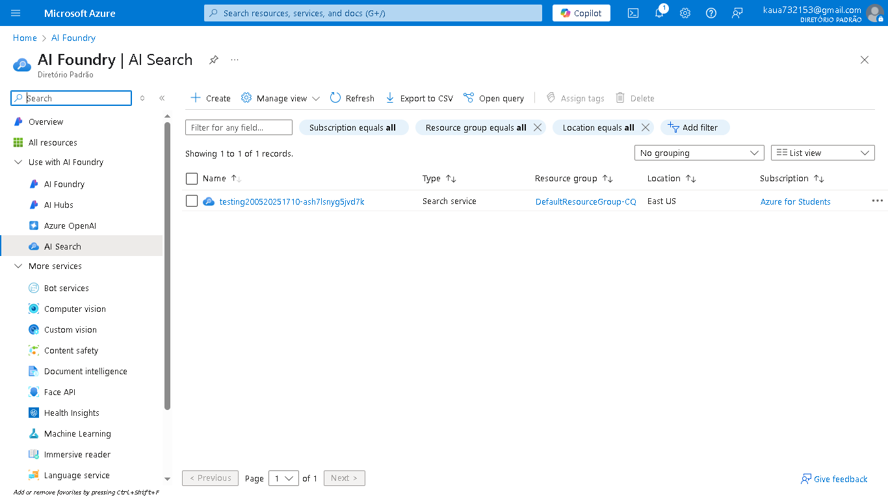
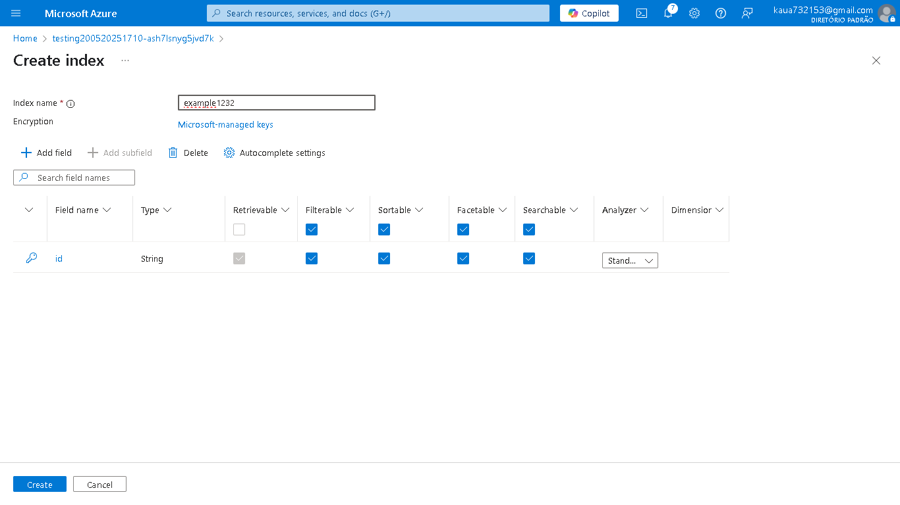
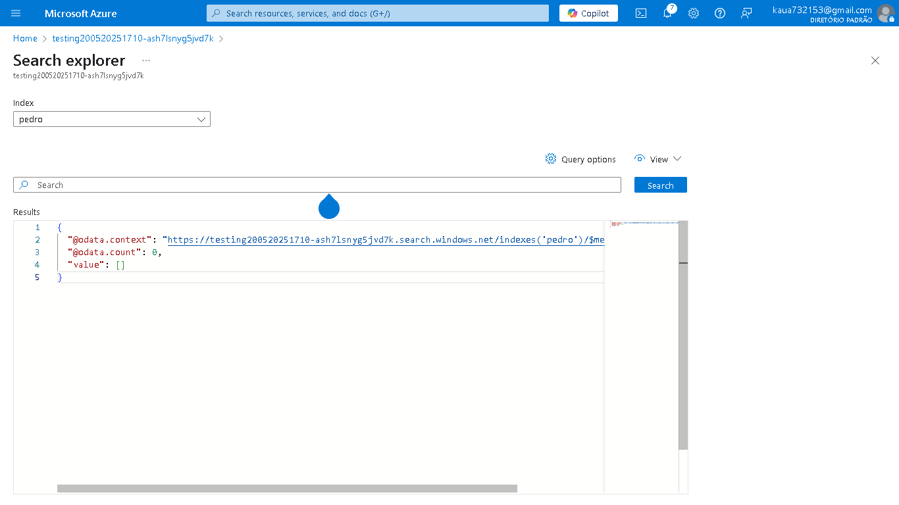

# 🔍 Azure AI Search Lab – Indexação e Consulta Inteligente de Dados

Este projeto é parte do laboratório prático da DIO, no qual exploramos o serviço **Azure Cognitive Search** com foco em **mineração de conhecimento** e **pesquisa inteligente** em grandes volumes de informação.

A proposta principal é demonstrar como a inteligência artificial pode ser aplicada na **organização, indexação e consulta de documentos**, usando os recursos nativos da plataforma Azure.

---

## 🧠 Objetivo do Projeto

Aplicar técnicas de:
- Ingestão de conteúdo para IA
- Criação de índices inteligentes
- Exploração de dados via **AI Search**

---

## ⚙️ Tecnologias Utilizadas

- ☁️ **Microsoft Azure**
- 🔍 **Azure Cognitive Search**
- 🤖 **AI Search com recursos de linguagem natural**
- 🧾 Interface gráfica (portal Azure)

---

## 🚀 O que foi feito

Neste projeto, realizamos:

1. **Configuração de um serviço Azure Cognitive Search**
2. Exploração dos recursos de **AI Search**, realizando consultas inteligentes
3. Análise de como a IA interpreta e responde a buscas com base em documentos indexados

> *Embora não tenha havido ingestão ou criação de índice personalizados neste laboratório, foi possível explorar a etapa mais poderosa: a busca assistida por inteligência artificial.*

---

## 📷 Capturas de Tela

As imagens abaixo demonstram as principais etapas da prática:

| Etapa | Imagem |
|------|--------|
| Painel do Azure Cognitive Search |  |
| Criação do serviço de busca |  |
| Exploração de dados na interface |  |

---

## 💡 Insight Final

> A experiência demonstrou como **ferramentas no-code/low-code** da Microsoft podem ser poderosas para **extrair conhecimento de grandes volumes de informação**, mesmo sem escrever uma linha de código.

Com o avanço da IA generativa e dos modelos semânticos, ferramentas como o Azure AI Search se tornam indispensáveis em sistemas que exigem **buscas inteligentes, contextualizadas e escaláveis**.

---

## 📁 Estrutura do Repositório

azure-ai-search-lab/
├── README.md
├── images/
└── assets/

---

## 🧠 Sobre

Este projeto faz parte do programa de formação **Java Cloud Developer** da [Digital Innovation One](https://www.dio.me/).

---
