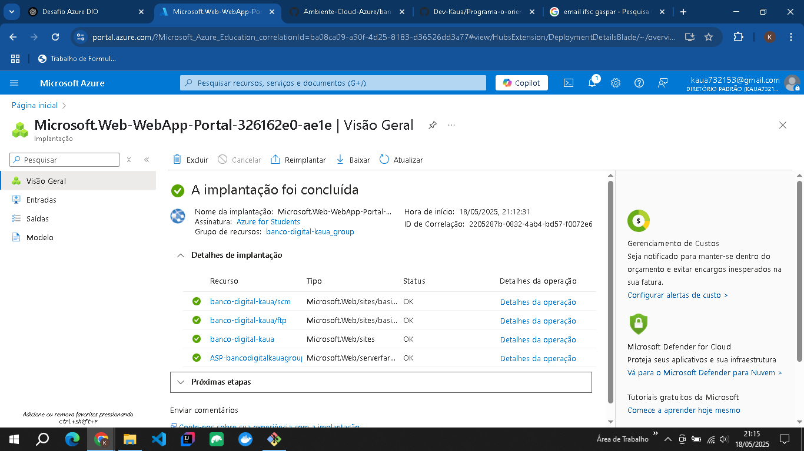

# ☁️ Banco Digital na Azure - Projeto DIO

Este projeto simula a implantação de uma aplicação Java no Microsoft Azure. O objetivo é mostrar como tornar uma aplicação de linha de comando pronta para cloud, utilizando recursos de nuvem e boas práticas de documentação e organização de repositório.

## 📘 Sobre o Projeto

O Banco Digital foi desenvolvido para treinar os conceitos de Programação Orientada a Objetos (POO) em Java, com suporte a:

- Criação de contas correntes e poupança
- Saques, depósitos e transferências
- Relatórios de saldo e operações

## 🧠 Conceitos Aplicados

- POO: abstração, herança, encapsulamento e polimorfismo
- Estrutura de classes e pacotes em Java
- Simulação de deploy em ambiente cloud (Azure)

## ☁️ Arquitetura na Azure

A ideia deste projeto é simular como essa aplicação poderia ser executada em uma instância do Azure App Service.

### Diagrama de Arquitetura:


### Print da criação do App Service:



## 🔧 Como Rodar Localmente

1. Clone este repositório:
   ```bash
   git clone https://github.com/Dev-Kaua/banco-digital-azure
   
2. Abra no IntelliJ, Eclipse ou outro IDE de sua preferência

3. Execute a classe Main.java

---

## 🚀 Possível Evolução
Refatorar para Spring Boot

Transformar em uma API RESTful

Conectar a um banco de dados Azure SQL

Fazer deploy real via GitHub Actions para Azure App Service

---

## 📂 Estrutura do Projeto
src/
└── banco/
    ├── Conta.java
    ├── ContaCorrente.java
    ├── ContaPoupanca.java
    └── Main.java

Se tiver sugestões ou quiser trocar ideias, sinta-se à vontade para abrir uma issue ou mandar um pull request!
