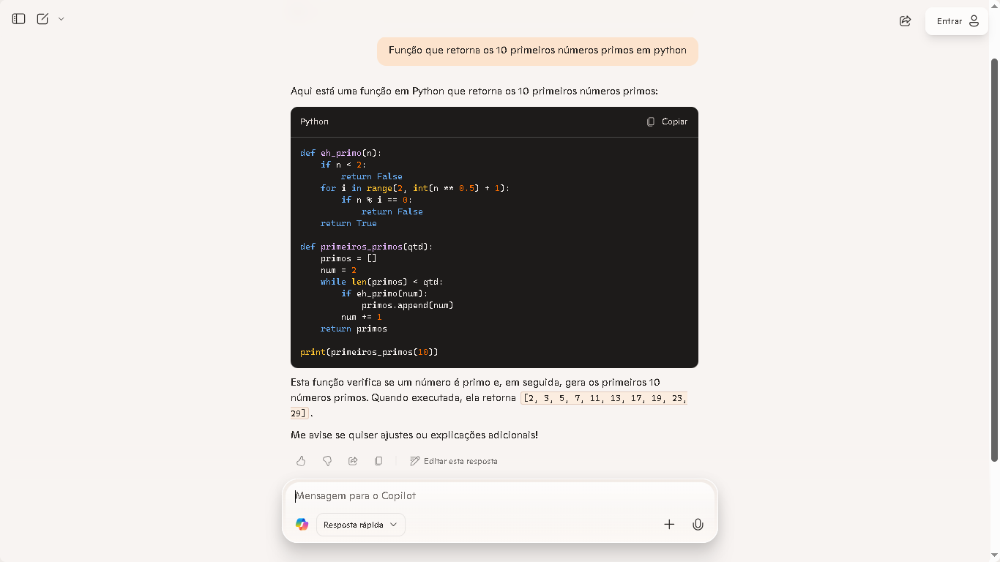
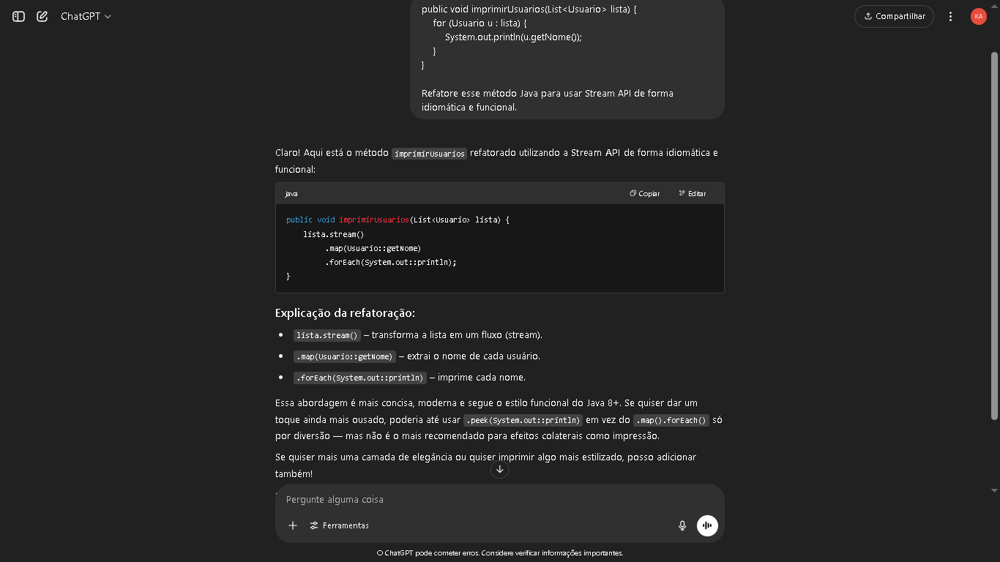
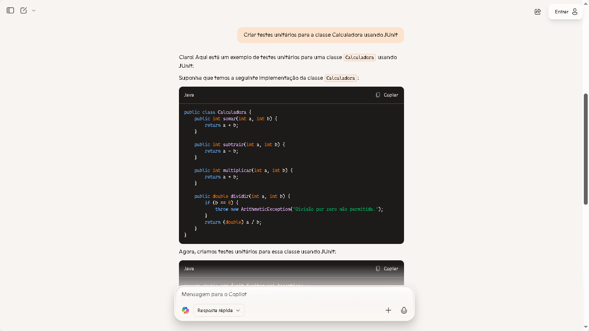
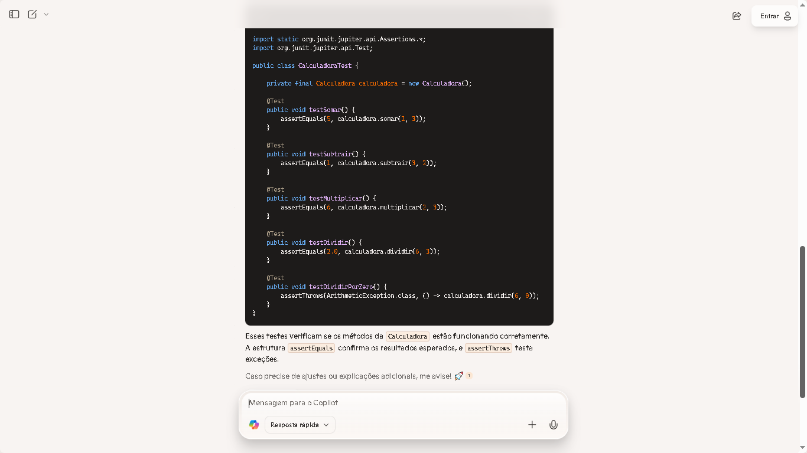
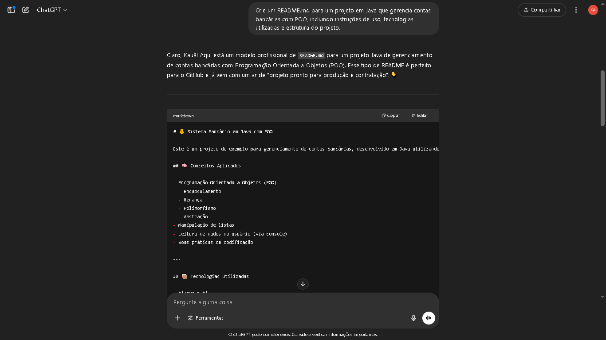

# 🤖 Explorando Recursos de IA Generativa com Copilot e OpenAI

Este projeto foi desenvolvido como parte do **curso Java Cloud Native** da DIO, com foco na aplicação prática de ferramentas de **Inteligência Artificial** para apoiar o desenvolvimento de software.

O laboratório teve como objetivo principal explorar o **GitHub Copilot** e a **API da OpenAI**, documentando exemplos reais de uso, boas práticas e aprendizados adquiridos durante os testes.

---

## 🧠 Objetivos do Projeto

- Explorar a geração de conteúdo com **OpenAI (ChatGPT)**
- Testar o suporte de código automatizado com **GitHub Copilot**
- Criar exemplos reais de aplicação das ferramentas
- Documentar os resultados e aprendizados em um repositório público

---

## 📁 Estrutura do Repositório

- `openai-exemplos.md`: Exemplos testados com OpenAI  
- `copiloto-exemplos.md`: Exemplos testados com GitHub Copilot  
- `README.md`: Documentação principal do projeto  
- `/images`: Prints das interações e resultados  

---

## 🚀 Tecnologias Utilizadas

- 🧠 [OpenAI - ChatGPT](https://platform.openai.com/)
- 🤖 [GitHub Copilot](https://github.com/features/copilot)
- ☕ Java + JUnit
- 🐍 Python

---

## 📸 Capturas de Tela

| Descrição                             | Imagem                                  |
|--------------------------------------|-----------------------------------------|
| Código em Python com IA              |         |
| Método Java gerado com IA            |            |
| Calculadora (Parte 1)                |   |
| Calculadora (Parte 2)                |   |
| Projeto entregue na DIO              |    |

---

## 📚 Documentação Técnica

### 🔹 Exemplos com OpenAI

Arquivo: [`openai-exemplos.md`](./openai-exemplos.md)  
Inclui os testes realizados com prompts no ChatGPT, focando em geração de código, explicações, boas práticas e revisão automática.

### 🔹 Exemplos com GitHub Copilot

Arquivo: [`copiloto-exemplos.md`](./copiloto-exemplos.md)  
Demonstra como o Copilot gera código completo com base em comentários simples, como funções matemáticas em Python e testes unitários em Java.

---

## 🧩 Aprendizados

- A IA pode acelerar MUITO o desenvolvimento, especialmente para tarefas repetitivas ou padrões de código comuns.
- Prompts bem escritos geram melhores respostas: clareza é tudo!
- Copilot é como um par programador virtual — não substitui o dev, mas turbina a produtividade.
- Documentar o processo é tão importante quanto escrever código.

---

## ✅ Conclusão

Essa experiência mostrou o **potencial real da IA no dia a dia de quem desenvolve software**. Tanto o ChatGPT quanto o Copilot são ferramentas poderosas quando usadas com inteligência e estratégia.

> “Quem dominar a IA, dominará o futuro da programação.” – Algum visionário do GitHub (provavelmente).

---

### 🔗 Autor

Desenvolvido por **Kauã Reis**  
Bootcamp: *Java Cloud Native | DIO + Bradesco*

  

